## 火山图
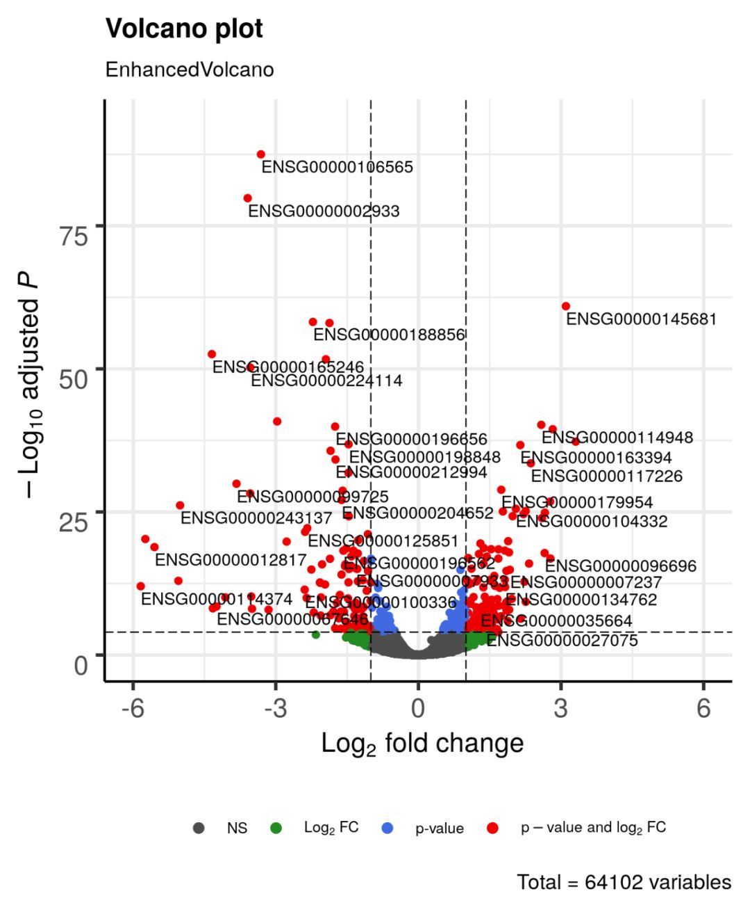

- 横轴：log2FC
    - 右边：在关注的样本中上调
    - 左边：在关注的样本中下调
- 纵轴：-log10 P-value（显著性）
    - 越高越不可能是巧合
- 阈值线：“够大、够稳”的最低标准
    - 竖线：log2FC = ±1
    - 横线：p = 0.05
- 应用：差异基因表达的一个概述

## 热图
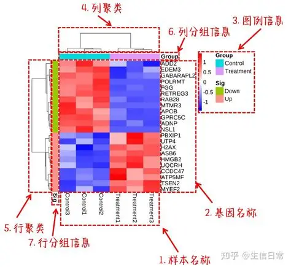

- 横轴：样本
- 纵轴：各种基因
- 颜色：用颜色表示表达量的高低
- 上方横线代表聚类分析
- 应用：展示各种基因在不同样本中的表达，观察其表达模式

## GESA（基因集富集分析）
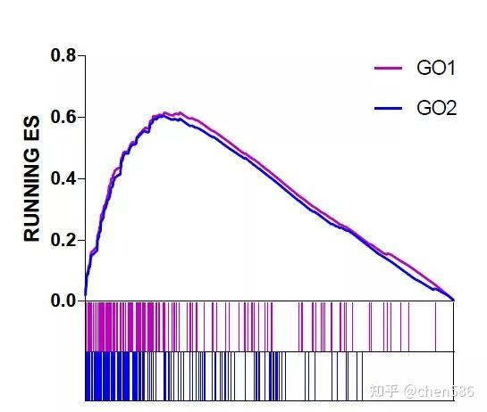

- 富集分析
- 纵轴：富集ES
    - 看到关注的基因 → 曲线往上跳
    - 看到无关基因 → 曲线慢慢往下滑
    - 峰值是正是负 = 通路往哪边偏
- 横轴：rank
    - 自己测的数据集进行了排序的表达量
- 上方每一条垂直线代表基因集中的一个基因
- 应用：一整群功能相关的基因，在该样本中的表达情况

## 相关性分析散点图
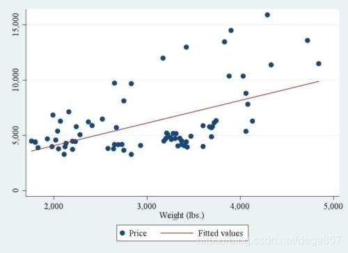

- 相关系数R
- 意义：横纵坐标变量是否有相关性

## 曼哈顿图
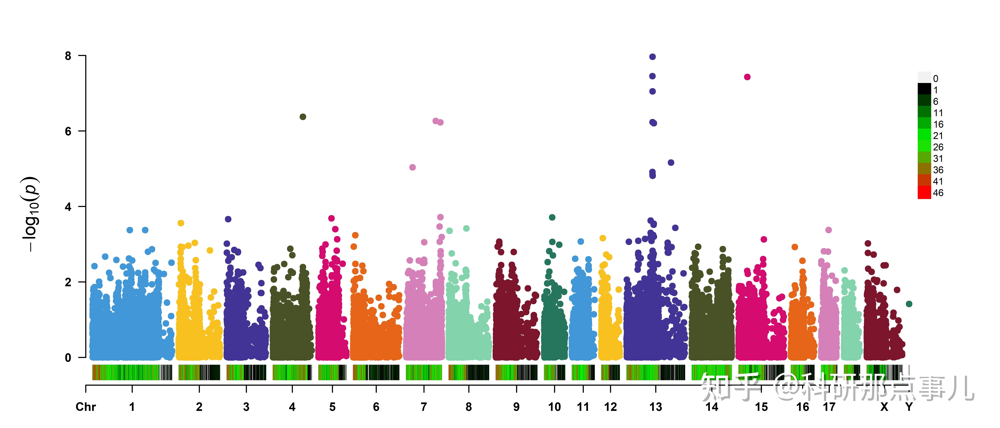

- 纵轴：显著性（p的负对数）
- 横轴：不同染色体
- SNP位点：人与人之间，DNA 上单个位点的差异
- 应用：全基因组的关联分析

## 森林图
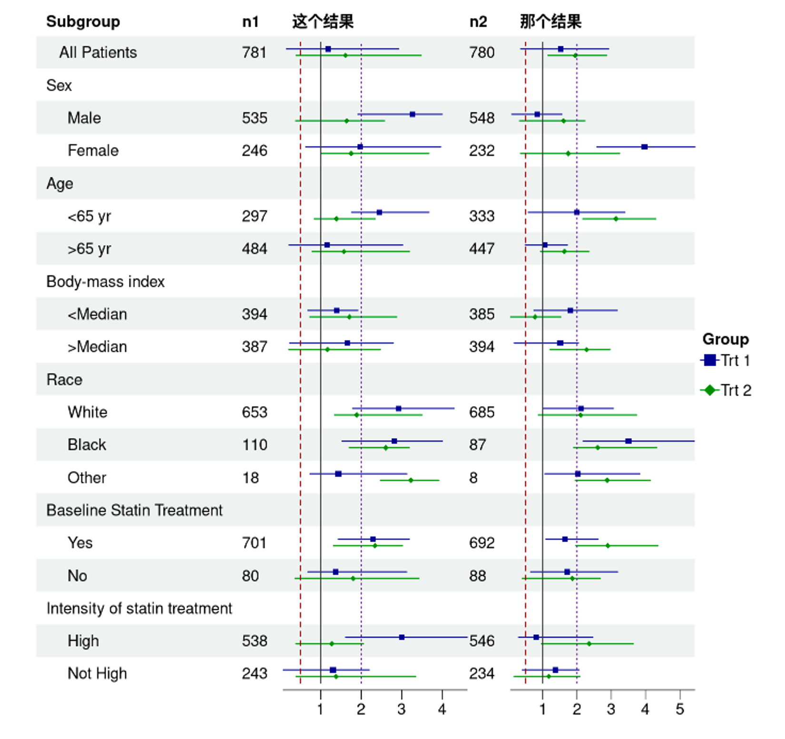
### cox回归
- 算“某个东西会不会让人更快出事”
- 回归的结果：风险比（HR）

| HR     | 人话       |
| ------ | -------- |
| HR = 1 | 没影响      |
| HR > 1 | 更快出事（危险） |
| HR < 1 | 更慢出事（保护） |

### 森林图 = 把一堆 HR 结果排成队
- 横轴：HR值
- 中间那条竖线：HR = 1
- 每一行：一个变量，可能是一个基因，一个癌种等
- 每一行中间的方块：HR 的估计值
- 每一行的横线：不确定范围（置信区间）

## 箱线图
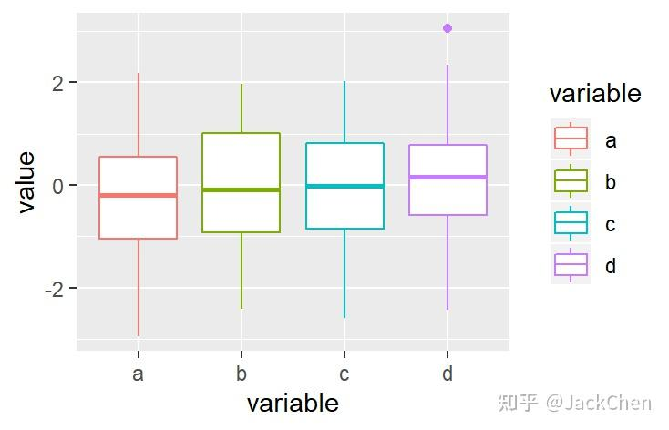

- 上边缘：最大观察值
- 下边缘：最小观察值
- 箱体上边缘：上四分位数
- 箱体下边缘：下四分位数
- 中间那条横线：中位数
- 用途：展示数据分布范围

## 小提琴图
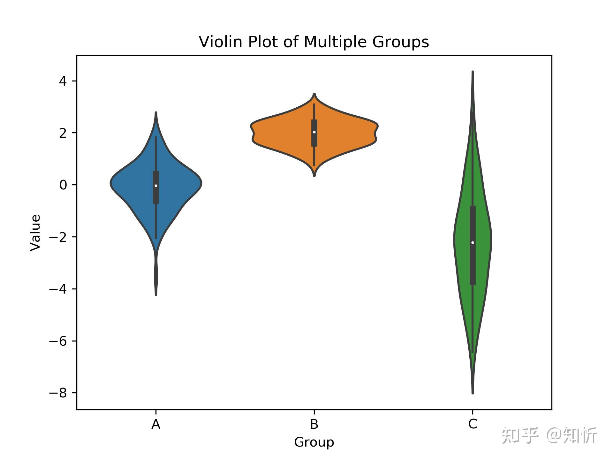

- 竖线：95%置信空间
- 密度图宽：频率
- 黑框：四分位数范围
- 用途：展示数据分布范围

## 气泡图
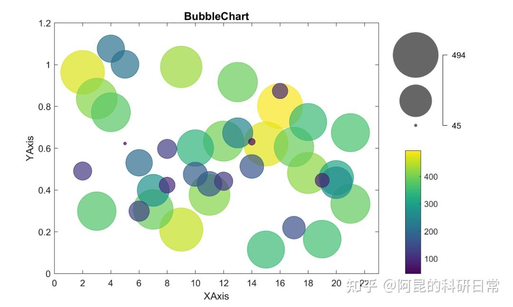

- 纵轴：通路 / 功能名字
- 横轴：GeneRatio / Enrichment score
- 点大小：命中基因数/显著性
- 点颜色：通路整体的偏向/显著性

## 生存曲线（KM线）
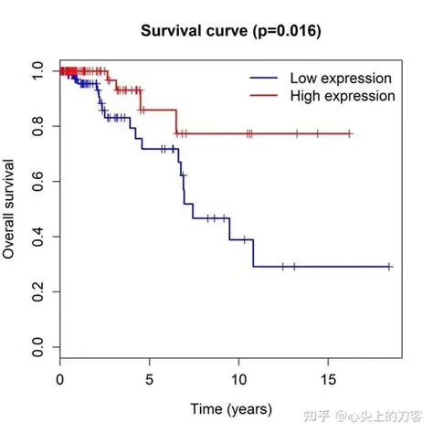

- 横轴：时间
- 纵轴：生存概率
- 一条或多条“阶梯状”的线(有人出事 → 掉一格)

## circos图
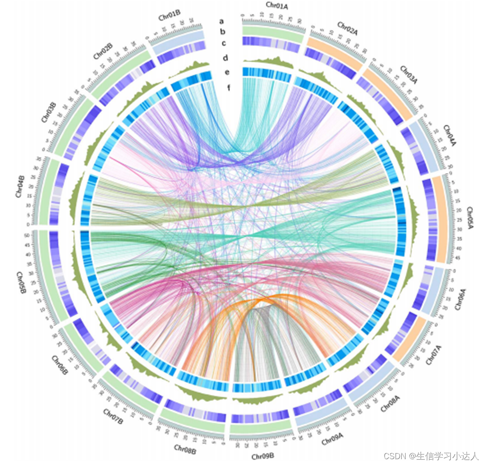
- 一个大圆环，外圈一圈标签（染色体 / 基因 / 区域）圆里面有各种各样的线
- 主要用途：
    - 染色体结构 & 突变
    - 基因–基因相互作用（PPI）
    - 基因–通路 / 基因–功能
    - 多组学关联（看起来最吓人）

## ROC曲线
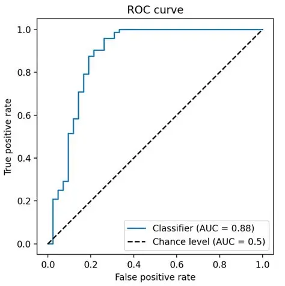

- 作用：反应不同诊断标准对相同目标的诊断敏感度和准确性
- 横轴：1-特异性
- 纵轴：敏感度
- 曲线下方的面积 = AUC，AUC越大预测准确率越高

## 相互作用网络关系图
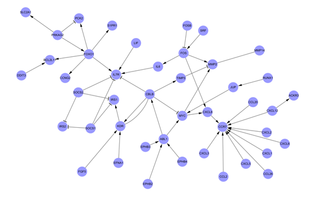
